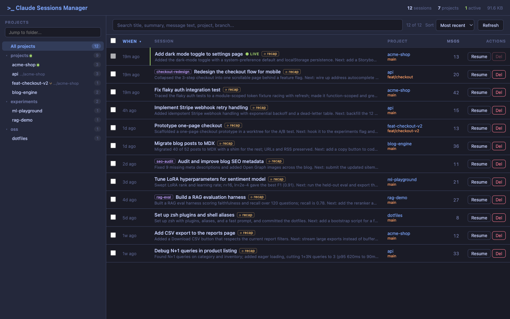

# Claude Session Manager

A TUI and Web UI for viewing, searching, and managing your [Claude Code](https://docs.anthropic.com/en/docs/claude-code) sessions.

If you've used Claude Code for any length of time, you already know the problem: dozens of sessions pile up under `~/.claude/`, each with its own JSONL transcript, tool results, and file history. Finding the right one to resume — or cleaning up the ones you don't need — is painful.

`clsm` makes that easy.

## Features

- **TUI** — interactive terminal UI with project navigation, sorting, filtering, and session details (built with [Textual](https://textual.textualize.io/))
- **Web UI** — browser-based interface with project sidebar, bulk selection, and deletion
- **Quick list** — fast terminal table output
- **Stats** — aggregate session statistics per project
- **Usage breakdown** — per-session token totals (input / output / cache read / cache write), cache hit ratio, model(s), and web tool counts in the detail view
- **Session deletion** — clean up old sessions (JSONL, tool results, file history)
- **Search** — filter by project, topic, branch, or message content
- **Resume** — copy resume commands or open sessions directly in a new terminal

## Where to start

- New here? Head to [Installation](installation.md), then [Quick Start](quickstart.md).
- Prefer the browser? See the [Web UI](web-ui.md) walkthrough.
- Live in the terminal? Jump to the [TUI](tui.md) reference.

## Links

- **Repo:** [github.com/ritwik-g/claude-session-manager](https://github.com/ritwik-g/claude-session-manager)
- **Releases:** [github.com/ritwik-g/claude-session-manager/releases](https://github.com/ritwik-g/claude-session-manager/releases)
- **Issues:** [github.com/ritwik-g/claude-session-manager/issues](https://github.com/ritwik-g/claude-session-manager/issues)
- **License:** MIT
