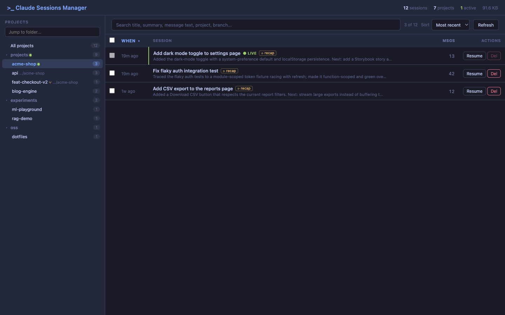
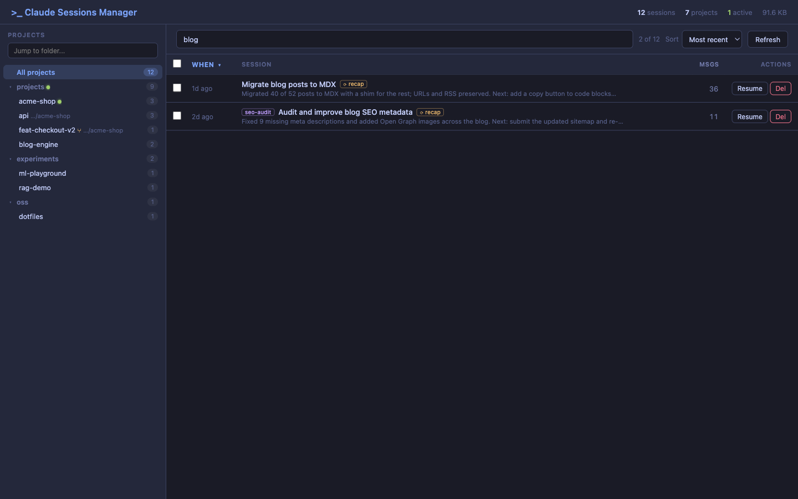
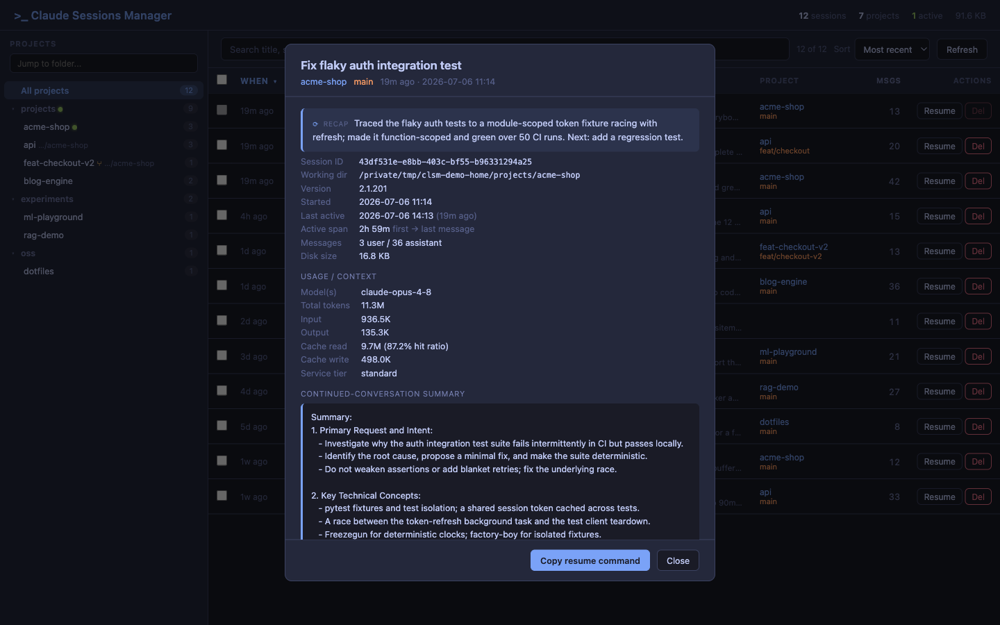

# Web UI

Launch with:

```bash
clsm --web
```

## Main view

The default view shows every session you've ever run, grouped by project on the left.


What you're looking at:

- **Header** — totals across all sessions (count, projects, on-disk size, currently active sessions).
- **Projects sidebar** — every project with a `~/.claude/projects/...` directory. The `*` marker means at least one session in that project is currently active. Click any row to scope the table to that project.
- **Sessions table** — date, project, branch, the user's first prompt (`Topic`), Claude's last response, message count, on-disk size, and per-row action buttons.
- **`ACTIVE` badge** — the green badge marks sessions that are still being written to (i.e. a `claude` process has the JSONL open). These rows have their delete button disabled so you can't accidentally nuke a live session.

## Filtering by project

Click any project in the sidebar to filter the table. The project column drops out (since it's redundant), and only that project's sessions remain.



Click **All Projects** at the top to clear the filter.

## Searching

The text box above the table filters by topic, branch, or first message — useful when you remember roughly what you were working on but not which project it was in.



Searching for `helm` here surfaces every session that mentioned helm in any field, across every project.

## Session details

Click **Info** on any row to open the details panel.



This panel gives you everything needed to triage a session at a glance:

- **Session ID** with a one-click **Copy Resume Cmd** button — paste it into a terminal to resume the session in Claude Code.
- **Status, project, working directory, branch, Claude version.**
- **Started + duration** — when the session began and how long it has been running.
- **Message counts** — user / assistant / total.
- **JSONL size and total on-disk size** (transcript + tool results + file history).
- **Usage / context** — model(s) used, total tokens (input, output, cache read with hit ratio, cache write), service tier, and any web search / web fetch counts. Aggregated from every assistant message in the session.
- **First message, last user message, last response** — enough context to remember what the session was about without having to resume it.

## Per-row actions

Each row exposes three buttons:

| Button | Action |
|--------|--------|
| **Copy** | Copies the `claude --resume <session-id>` command to your clipboard. |
| **Info** | Opens the details panel shown above. |
| **Del** | Deletes the session — JSONL transcript, tool results, file history. Disabled for active sessions. |

## Bulk delete

Use the checkboxes in the leftmost column to select multiple sessions, then trigger the bulk-delete action. Active sessions are excluded automatically — their checkboxes are disabled.
